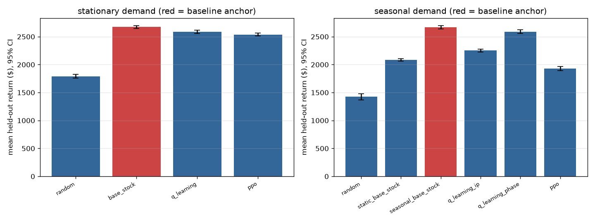
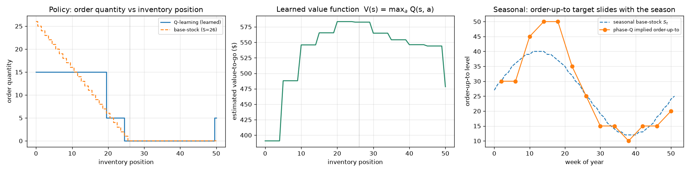
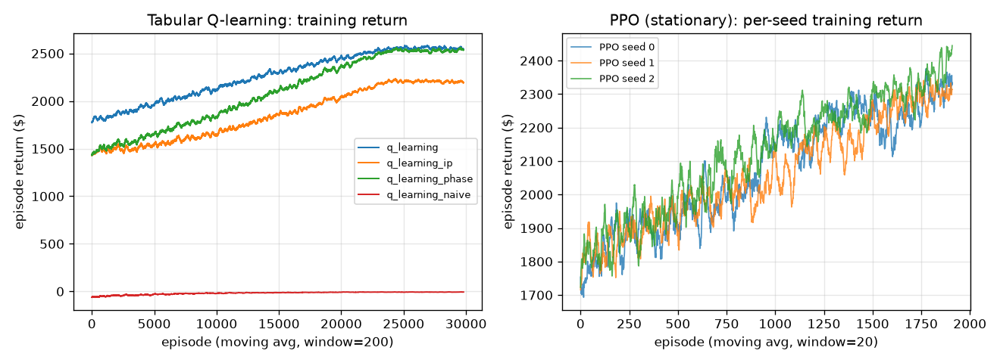
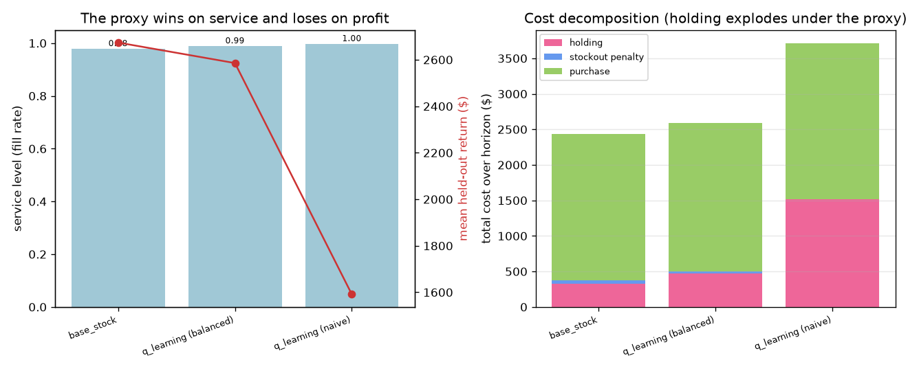

# Single-SKU Inventory Replenishment — a tabular-RL agent (with a PPO stretch)

A small but honest reinforcement-learning system: an agent decides how much stock to reorder
each week for one SKU, under stochastic demand and a delivery lead time, and is benchmarked
against the **newsvendor base-stock policy** — the near-optimal analytical answer. Tabular
Q-learning is the deliverable; a Stable-Baselines3 PPO agent is a committed stretch. The whole
core path runs on CPU in a couple of minutes with **no GPU and no API keys**.

> Course assignment for *Designing & Building Agentic AI Systems* (MMA). Scope by design:
> **one SKU, one warehouse, a simulator** — no real side effects. The interesting work is the
> framing, the reward, the evaluation, and the production-risk argument, not the compute.

---

## 1. What it does (use case)

Each period the agent observes its inventory position (on-hand plus in-transit stock) and the
week, then chooses an order quantity from a small menu. The order arrives after a lead time;
demand is random; unmet demand is **lost** (not back-ordered). The agent is rewarded for profit
net of holding, stockout, and purchase costs — and it is **evaluated on that true objective
even when it was trained on a different one** (the reward-hacking experiment).

Example (a real held-out episode under the learned policy; see `evidence/sample_run_log.txt`):

```text
$ python -m inventory_rl.cli demo
Sample held-out episode -- q_learning, stationary demand
episode return = $2503.00  service level = 0.981

week  on_hand  order  demand  sales  unmet
   0        1     15       9      9      0
   1        8     15       8      8      0
   2       11      5      12     12      0
   ...
  11        0      5      23     20      3      <- a demand spike (23) outruns stock; 3 units lost
```

The agent keeps inventory position hovering near the base-stock level (~20), tops up with small
orders, and only stocks out when demand spikes beyond what the protection interval can cover —
exactly the behavior the analytical policy predicts.

---

## 2. Design in one idea

> **The reward is the product; the constraints are code.**

Everything the business cares about lives in the **reward** (`rewards.py`) — and the single most
important lesson of the project is that a *wrong* reward produces a confident, well-trained agent
that quietly destroys value. Everything that must **never** happen — ordering past warehouse
capacity, negative orders — lives in the **environment** as hard clamps the policy cannot cross
(`env.py`), not as penalties it is free to trade away.

```text
        ┌─────────── perceive ───────────┐
  state (on-hand, pipeline, week)         │
        │                                 │
        ▼                                 │
   policy  ──►  order (clamped to safe range)  ──►  env: receive · sell · lose
        ▲                                 │                    │
        │                                 │                    ▼
   learn (Q-update / PPO)  ◄──── reward ◄─┴──── balanced profit, costs, salvage
```

See [`docs/DESIGN.md`](docs/DESIGN.md) for the full MDP & safety contract, the rubric mapping,
and the course-deck citations; [`docs/REFLECTION.md`](docs/REFLECTION.md) for the honest build
log; and [`docs/BUSINESS_MEMO.md`](docs/BUSINESS_MEMO.md) for the deploy/shadow/reject decision.
For a single self-contained narrative of the framing, methods, results, and reflection, see the
research-paper writeup [`paper/report.pdf`](paper/report.pdf) (LaTeX source alongside it,
Overleaf- and `pdflatex`-ready).

---

## 3. The world as an MDP

| Element | This problem | Where it lives |
|---|---|---|
| **State** | inventory position = on-hand + in-transit pipeline (+ a season phase for the seasonal agent) | `env.py`, `q_learning.discretize` |
| **Action** | an order quantity from `{0, 5, 10, 15, 20, 25, 30}` | `config.ACTION_MENU` |
| **Transition** | receive the order placed `L` periods ago → place a (clamped) order → realize `Poisson` demand → sell what stock allows, lose the rest | `env.step` |
| **Reward** | `price·sales − cost·order − holding·on_hand − penalty·unmet − fixed·1[order] (+ salvage at horizon)` | `rewards.reward_balanced` |
| **Discount** `γ` | 0.99 — a mild time preference over the finite horizon | `config.QLearnParams.gamma` |
| **Horizon** | finite, 52 weeks (one season) | `config.EnvParams.horizon` |
| **Constraints** | `0 ≤ order ≤ 30`, `on_hand ≤ 50` (hard, enforced in `env.step`); orders above 25 are flagged for human approval | `env.step` |

Economics (`config.EnvParams`): price 10, cost 4 (margin 6), holding 1/unit/week, stockout
penalty 5/unit, lead time 1. The **newsvendor underage cost is `Cu = (10−4) + 5 = 11`** (lost
margin *plus* penalty), overage `Co = 1`, so the critical ratio is `11/12 ≈ 0.917` over the
two-week protection interval → an order-up-to level **S = 26**.

---

## 4. Repository layout

```text
inventory-rl/
├─ README.md                  ← you are here
├─ pyproject.toml             ← package + pinned deps; ruff / mypy / pytest config
├─ requirements-core.txt      ← frozen core lock (no torch, no GPU)
├─ requirements-stretch.txt   ← core + CPU torch + Stable-Baselines3 (PPO only)
├─ src/inventory_rl/
│  ├─ config.py               ← SEED + every parameter as frozen dataclasses
│  ├─ env.py                  ← the simulator (Gymnasium env); hard-constraint clamps; mass_balance
│  ├─ demand.py               ← stationary / seasonal demand + the stress-scenario registry
│  ├─ rewards.py              ← reward_balanced vs reward_naive (the reward-hacking pair)
│  ├─ baselines.py            ← random, base-stock (newsvendor S), seasonal S_t, (s,S)
│  ├─ q_learning.py           ← tabular Q-learning + state discretization + policy extraction
│  ├─ ppo_agent.py            ← SB3 PPO stretch (torch import guarded)
│  ├─ evaluation.py           ← paired held-out evaluation, bootstrap CIs, Wilcoxon, reports
│  ├─ experiments.py          ← orchestration: train all agents, run the matrix + reward hacking
│  ├─ plotting.py             ← the four committed figures (Agg backend)
│  └─ cli.py                  ← train / evaluate / plot / demo / all
├─ evals/                     ← scenarios.jsonl (7 edge episodes) + run_evals.py (Tier A/B)
├─ tests/                     ← 51 pytest unit tests (core deps only)
├─ models/                    ← committed: q_table*.npz, ppo_*.zip
├─ figures/                   ← committed PNGs (reward curve, comparison, behavior, hacking)
├─ evidence/                  ← committed run evidence: eval_report.json, results.csv, logs, scenario/training reports
├─ docs/                      ← DESIGN.md, REFLECTION.md, BUSINESS_MEMO.md
└─ paper/                     ← report.tex + built report.pdf (research-paper writeup)
```

---

## 5. Setup (reproducible, pinned)

Pinned to **Python 3.12** on purpose (the build machine had 3.14; pinning avoids wheel risk).
Two dependency files keep the install light: the **core** path needs neither torch nor a GPU.

```powershell
# Windows PowerShell, from the repo root
py -3.12 -m venv .venv          # or: uv venv --python 3.12
.\.venv\Scripts\Activate.ps1
# macOS/Linux: python3.12 -m venv .venv && source .venv/bin/activate
pip install -r requirements-core.txt    # numpy, scipy, gymnasium, matplotlib, pandas + dev tools
pip install -e . --no-deps              # add the package itself

# Optional PPO stretch (large; only needed to RETRAIN PPO — the committed model evaluates without it):
pip install -r requirements-stretch.txt
```

> **Reproducible with no API key and no GPU.** A fresh `requirements-core.txt` venv runs all 51
> tests, the Tier-A scenario harness, a clean `ruff`/`mypy`, and the entire tabular pipeline
> (`inventory-rl all`) on CPU. Clean-room verified: a from-scratch frozen-lock venv reproduces the
> headline numbers **exactly** (Q-learning stationary return 2585.6), because every source of
> randomness is a seeded `numpy` generator — there are no unseeded global RNG calls. The committed
> `models/` and `figures/` mean a grader never has to retrain anything; each run also stamps a
> deterministic `run_id` into `evidence/eval_report.json` for traceability.

---

## 6. Runtime modes

| Mode | Install | What runs |
|---|---|---|
| **core** (default) | `requirements-core.txt` | tabular Q-learning, all baselines, the full evaluation matrix, every figure, the scenario harness. No torch, no GPU. |
| **stretch** | `requirements-stretch.txt` | additionally trains/evaluates the PPO agent. The committed `ppo_*.zip` are loaded automatically by `all` and `evaluate` when present. |

---

## 7. How to run

```powershell
# 1) Quality gate (no key, no GPU)
python -m pytest -q
python -m ruff check src/ evals/ tests/
python -m mypy src/inventory_rl

# 2) The whole pipeline: train -> evaluate -> reward-hacking -> figures + report
python -m inventory_rl.cli all              # ~2-3 min on a laptop (loads PPO if present)

# 3) Individual verbs
python -m inventory_rl.cli demo             # one held-out episode, printed
python -m inventory_rl.cli train            # train + save the Q-tables
python -m inventory_rl.cli train --agent ppo --seeds 3 --timesteps 100000   # (stretch) retrain PPO
python -m inventory_rl.cli evaluate         # the matrix + report, no figures

# 4) Edge-episode scenario harness (Tier A always; Tier B adds PPO if the artifact + torch exist)
python -m evals.run_evals
python -m evals.run_evals --offline         # Tier A only (no torch)
```

---

## 8. Agent, reward & safety contract

**Baselines (the ladder — climb only as far as the problem demands):**

| Policy | What it is | Role |
|---|---|---|
| `random` | uniform order | the floor any agent must beat |
| `base_stock` | order up to `S = 26` (newsvendor) | the near-optimal stationary **anchor** |
| `seasonal_base_stock` | week-indexed `S_t` | the fair **adaptive** competitor under seasonality |
| `(s, S)` | reorder-point variant | for the fixed-order-cost case (`K > 0`) |

**Tabular Q-learning** (`q_learning.py`): state = inventory-position bins (11 bins; +13 season
phases for the seasonal agent); Robbins–Monro learning rate `1/(1+visits)`; `γ = 0.99`; ε
annealed 1.0 → 0.05; 30,000 training episodes (seconds). The greedy policy is plotted directly
over base-stock to show it recovered the order-up-to structure.

**What the model decides, what code decides, what is forbidden** (the deck's closing question):

| Learned (reward-shaped) | Coded (always) | Forbidden (hard limit) |
|---|---|---|
| how much to order in each state | newsvendor baseline; cost accounting; salvage | ordering past warehouse capacity (`on_hand ≤ 50`) |
| when to stop ordering (the implied target) | the approval flag above 25 units | negative orders |
| how to ride out a demand swing | held-out, paired evaluation | learning its way around either limit |

Hard constraints are enforced in `env.step` *before* an order is placed, so no reward — naive or
balanced — can buy its way through them. This is why the reward-hacking agent, for all its
over-ordering, still records **zero capacity violations**.

---

## 9. Evaluation & evidence

Every policy is scored on **100 held-out (out-of-sample) demand episodes**, with each policy
facing the *identical* demand realization per episode (a paired design). Differences are reported
with 95% **paired-bootstrap** confidence intervals and a Wilcoxon signed-rank test. Raw numbers
are in [`evidence/eval_report.json`](evidence/eval_report.json) and
[`evidence/results.csv`](evidence/results.csv).



**Does RL beat the baseline?** Honestly: *no, and it should not.* Under stationary demand a
correctly specified base-stock is near-optimal, and tabular Q-learning lands **within 3.3%** of it
(mean gap −$88 per episode, 95% CI [−98, −79]). That is the point — the *negative* result that
shows RL is not being oversold. The value of RL appears under **seasonal** demand: a *static*
base-stock is misspecified and loses ~$580/episode, while the **phase-aware Q-agent ties the
seasonal base-stock** (gap −$79, CI [−91, −66]) and beats the static one by ~$500/episode —
**recovering the seasonal solution from reward alone, without being handed the seasonal model**.
(Caveat: a planner who *can* write down the seasonality does not need RL; RL hedges against not
knowing it.)



**Did it learn something sensible?** The learned order curve (left) traces the base-stock
staircase — order hard when empty, stop near `S = 26`. The middle panel shows the learned **value
function** `V(s) = max_a Q(s, a)`: it peaks at moderate inventory and falls off toward both stockout
and overstock — the shape the Bellman recursion should produce, and direct evidence the agent
learned *values*, not just an action rule. The phase agent's implied order-up-to level (right)
slides up in the high season and down in the low season, tracking `S_t` — which a single static
level cannot do.



**Convergence and stability.** Tabular returns climb smoothly and settle in well under the budget.
PPO (right) is shown across seeds: it is both **slower to converge and visibly seed-variable**,
and on this small problem it lands *below* the tabular agent — a concrete argument for the
baseline ladder.



**Reward hacking (the headline safety result).** Train the same agent on a tempting proxy —
*"just minimize stockouts"* — and it games it perfectly: service rises to **0.997** (vs 0.989) but
true economic return **falls 38.5%** (−$995/episode) as it floods the warehouse to **29 units
on-hand vs 9** and holding cost explodes (right panel). The proxy was satisfied; the business was
not. The warehouse cap **bounded the damage** — the safety constraint is the seatbelt that made
the failure survivable.

**All four failure modes, measured — not asserted** (the `failure_analysis` block of
`eval_report.json`):

- **Reward hacking** — above: −38.5% profit for +0.8 service points.
- **Instability** — PPO's three training seeds finish at 2303 / 2299 / 2369 (a visible spread, all
  below the deterministic tabular agent). Deep RL buys variance, not value, on a problem this small.
- **Overfitting / generalization** — under a demand shift (λ=10 → λ=16), the learned policy
  actually tracks the oracle base-stock *closer* (gap-to-oracle **685**) than the statically tuned
  `S=26` rule (gap **1,549**), which rigidly under-stocks once demand rises. This **corrected my
  prior** (I had assumed the formula would generalize better) — see `docs/REFLECTION.md` #10.
- **Unsafe behavior (safety ablation)** — a pathological always-max-order policy floods the
  warehouse to a peak of **1,023 units (49 violations) with the capacity clamp disabled**, but is
  bounded to **39 units, zero violations** with it on. The guarantee is in the environment, not the
  policy.

The scenario harness ([`evals/run_evals.py`](evals/run_evals.py)) additionally runs 7 stress
episodes (demand spike, drought, lead-time shock, distribution shift, zero-demand, cap-pressure,
approval-gate) and asserts the **zero-capacity-violation** invariant across every policy.

**Robustness — the tie is not a lucky configuration.** A dedicated study (`run_robustness_study`,
also in the report) retrains the agent across discretizations and seeds. It is **robust to bin
width across 2–10** (all within ~3% of base-stock) but **collapses once bins are too coarse to
represent the order-up-to structure** (width 25 → 3 states → the policy degrades catastrophically),
which is exactly where the discretization stops being able to express "stop ordering near S". Across
three training **seeds** the held-out return varies by only **~$35** (2586 / 2612 / 2621) — the
result is a property of the method, not a seed. I also checked the **finite-horizon tail**: the
stationary agent's state excludes the week, so it cannot exploit the horizon, and its last-period
order ($41.6 of waste) is within $2.40 of base-stock's ($39.2) — the comparison is not confounded.

The whole pipeline (`inventory-rl all`) — train four agents, run the matrix, all four failure
experiments, and the robustness study — completes in **~135 seconds** on a laptop (CPU, no GPU).

---

## 10. Limitations & honest risks

- **One SKU, synthetic demand.** A toy simulator, not a supply chain. Poisson demand and a fixed
  lead time are deliberate simplifications; real demand is correlated, censored, and promotion-driven.
- **Base-stock is a heuristic here, not the proven optimum.** Under *lost sales* base-stock is
  near-optimal but not exactly optimal, so a tiny RL edge is theoretically possible; our CIs show
  the stationary gap is small and against RL, so we report the honest tie.
- **Discretization has a safe range, not infinite headroom.** The agent is robust to bin width
  across 2–10 (all ~3% of base-stock) but collapses once bins are too coarse (width 25, 3 states)
  to represent the order-up-to structure — measured in the robustness study, not assumed.
- **PPO seed variance.** A single PPO seed is not trustworthy; we report a multi-seed spread and
  do not let PPO carry the headline.
- **Reward-proxy residual risk.** The balanced reward is *a* model of the objective, not the
  objective. The whole project is a warning about what happens when that model is wrong.

See [`docs/REFLECTION.md`](docs/REFLECTION.md) for the full failure analysis and
[`docs/BUSINESS_MEMO.md`](docs/BUSINESS_MEMO.md) for the deployment recommendation (**shadow first**).

---

## 11. Closing frame

Before deploying any learning agent, answer three questions on one page:

- **What should be learned?** The ordering policy — how much to buy in each state, including the
  seasonal timing a static rule misses.
- **What should be coded?** The cost accounting, the analytical baseline we must beat, and the
  evaluation that decides whether we did.
- **What should be forbidden?** Ordering past capacity and negative orders — enforced by the
  environment, never left to the reward.

That boundary is the whole design. The reward-hacking experiment is what happens when you get the
first question's *objective* wrong; the zero-violation guarantee is what the third question buys you.
